# Supplementary: SOTA Model Performance Comparison

## Diagram 1: LLM Performance Evolution
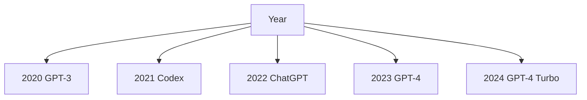

## Diagram 2: Benchmark Categories
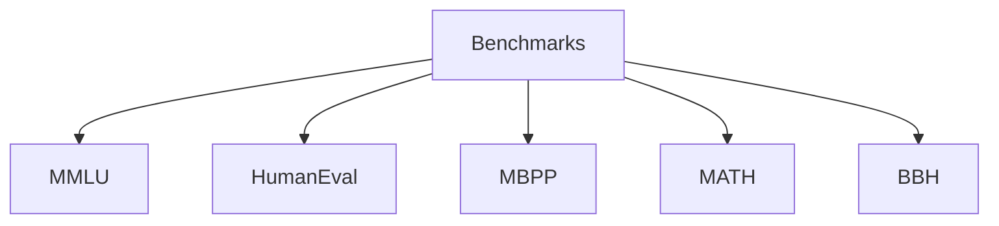

## Diagram 3: Vision Models Timeline
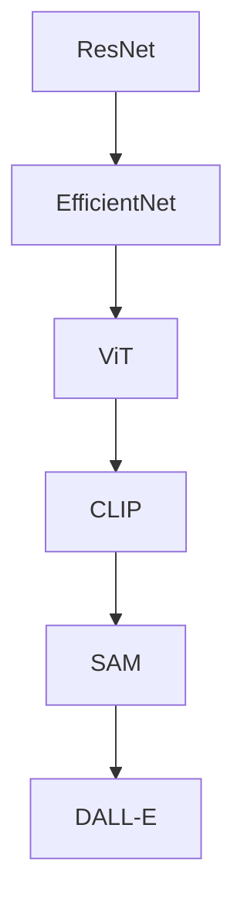

## Diagram 4: NLP Models
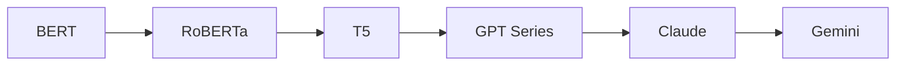

## Diagram 5: Multimodal Models
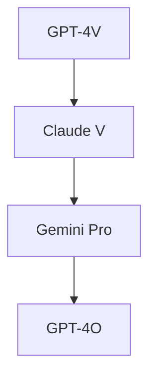

## Diagram 6: Code Generation
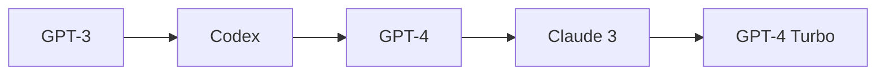

## Diagram 7: Parameter Efficiency
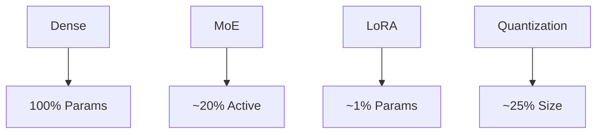

## Diagram 8: Training Compute
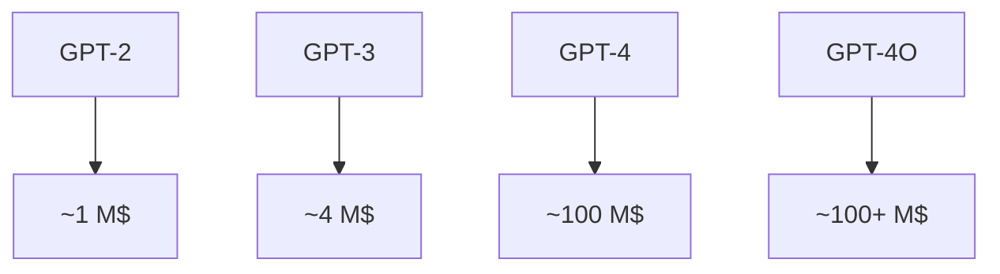

## Diagram 9: Context Length Evolution
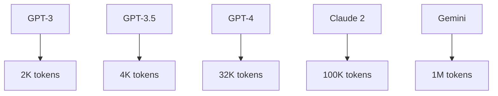

## Diagram 10: Inference Speed
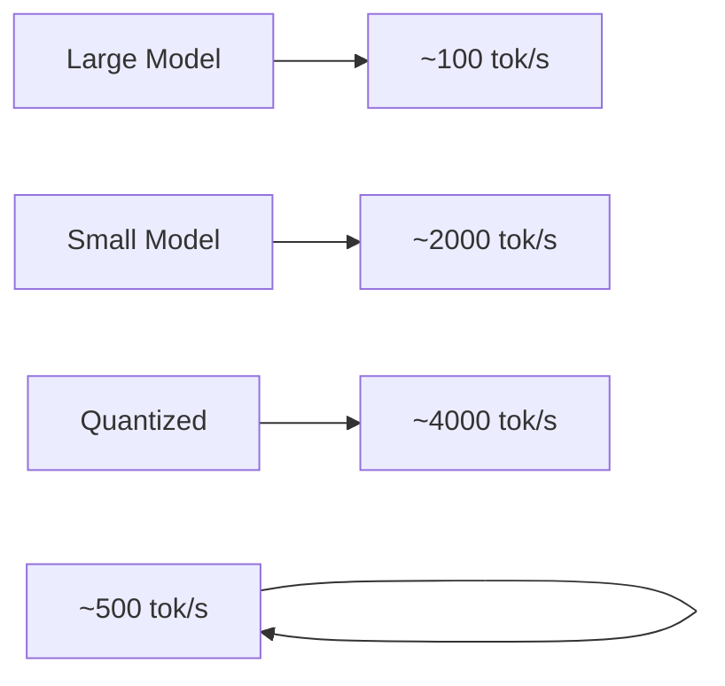

## Diagram 11: Cost per 1M Tokens
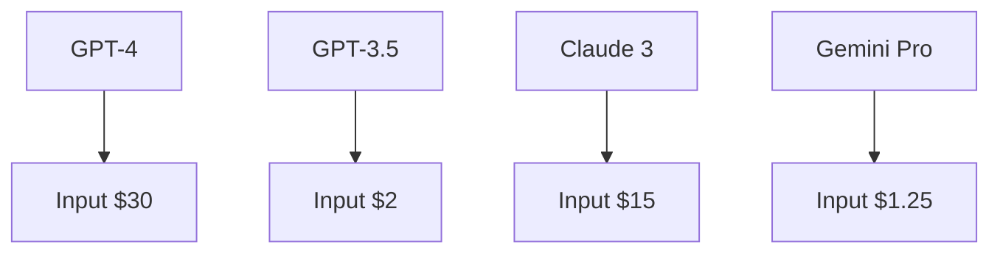

## Diagram 12: Accuracy vs Cost
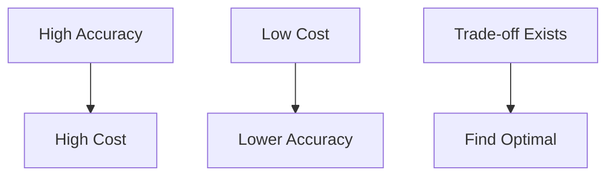

## Diagram 13: Open vs Closed Source
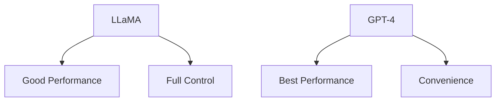

## Diagram 14: Fine-tuning Methods
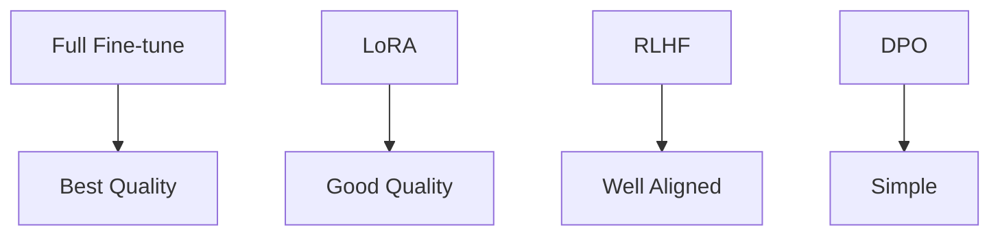

## Diagram 15: Model Selection Guide
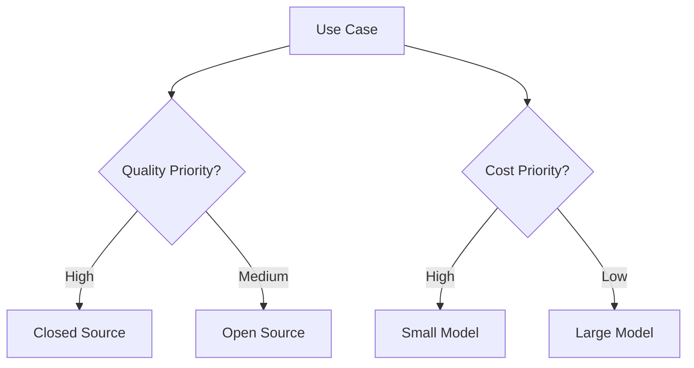
