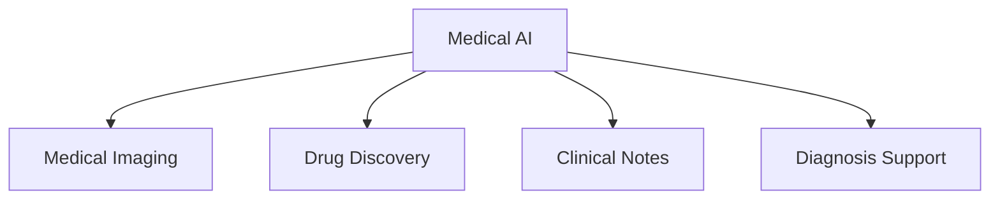
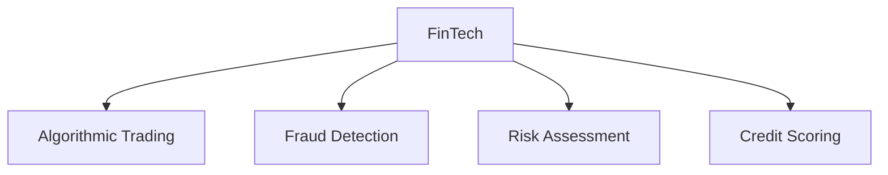
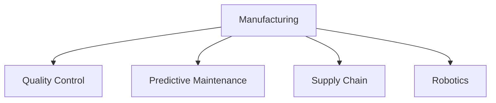
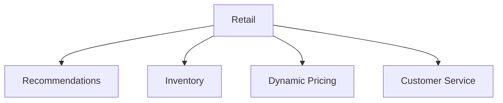
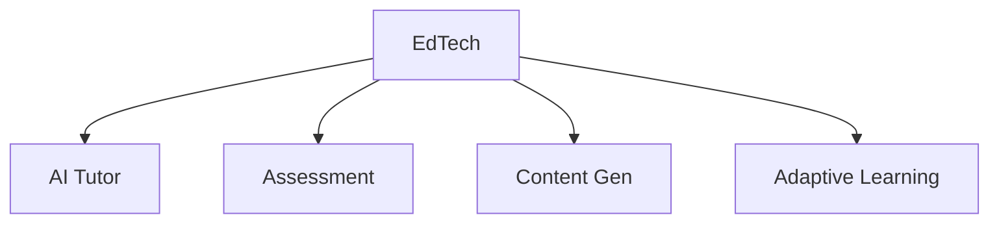
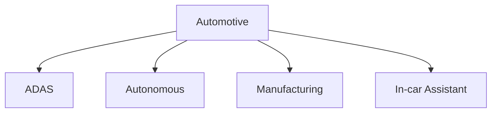
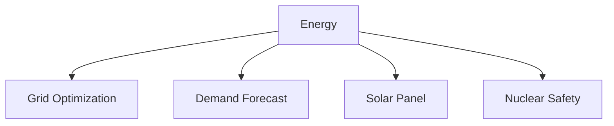
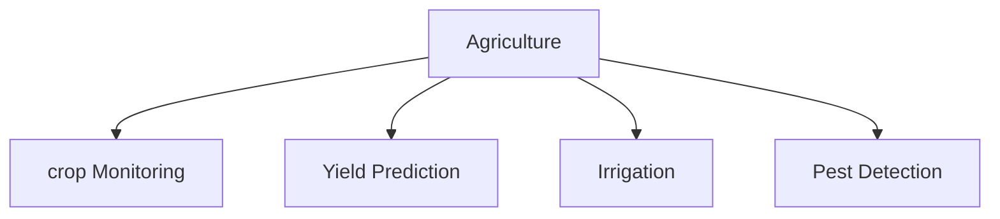
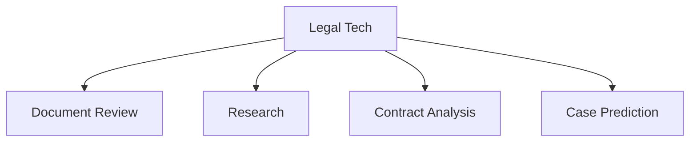
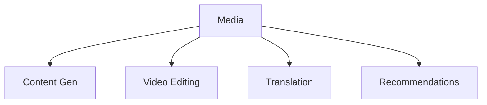

# Supplementary: Industry Application Cases

## Diagram 1: Healthcare Applications

## Diagram 2: Finance Applications

## Diagram 3: Manufacturing Applications

## Diagram 4: Retail Applications

## Diagram 5: Education Applications

## Diagram 6: Automotive Applications

## Diagram 7: Energy Applications

## Diagram 8: Agriculture Applications

## Diagram 9: Legal Applications

## Diagram 10: Media Applications

