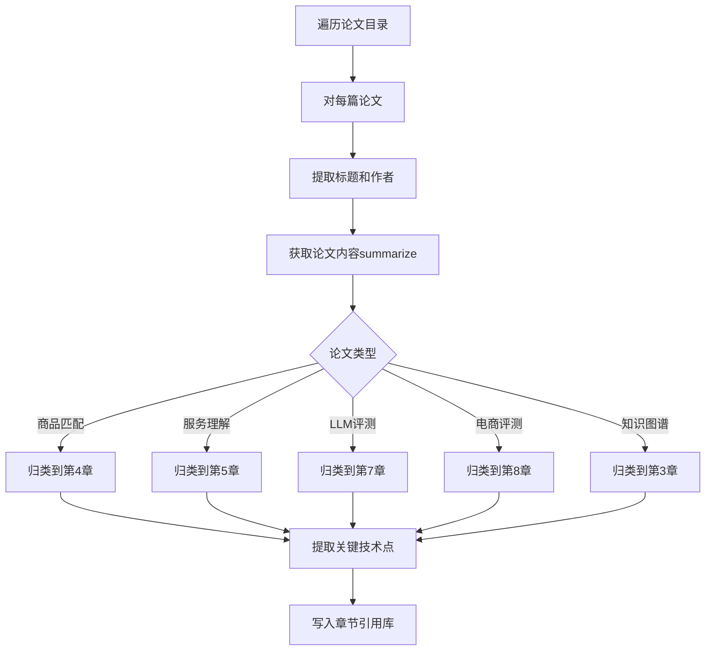

# Deep Academic Book Writing Skill - 深度学术书籍写作

## 核心目标
写一本深度足够的《供给理解及其评测体系》学术书籍，每章要有技术深度，章节之间要有清晰的逻辑关系。

## 关键要求

### 1. 分析所有论文，不只是抽取
**必须分析所有论文目录下的论文，不只是看摘要和片段，而是深入分析每一篇：**

#### 论文目录（必须全部分析）
```bash
# 先查看有哪些论文
ls /Users/rrp/Documents/aicode/data/papers/
# product_matching/ - 200篇商品匹配论文
# llm_judge_benchmark/ - 78篇LLM评测论文  
# ecommerce_evaluation/ - 123篇电商评测论文
# mini_program_service/ - 100篇小程序服务论文
# tech_blogs/ - 100篇技术博客
```

#### 分析每篇论文的要求
对于每篇论文，必须：
1. **读取PDF或获取论文内容** - 使用summarize工具提取全文内容
2. **提取核心信息**：
   - 作者、机构、年份
   - 论文标题（英文/中文）
   - 核心创新点（Novelty）
   - 技术方法（Method）
   - 实验设置（Experiment）
   - 主要结论（Conclusion）
   - 相关工作（Related Work）
3. **分类归档** - 按主题分类到不同章节的引用库
4. **提取技术细节** - 公式、算法、架构等

#### 论文分析流程


### 2. 建立章节关系图
在开始写作前，先设计章节之间的逻辑关系：

```
第1章(定义) 
    ↓ 基础概念引入
第2章(技术演进) 
    ↓ 沿着时间线讲清楚发展脉络
第3章(知识图谱) 
    ↓ 在技术基础上讲知识图谱如何赋能
第4章(商品理解) 
    ↓ 具体场景应用
第5章(服务理解) 
    ↓ 从商品到服务的扩展
第6章(双向匹配) 
    ↓ 前几章技术的综合应用
第7-10章(评测) 
    ↓ 基于理解技术的评测方法
第11-13章(应用与展望)
```

每章开头必须说明：
- 本章与上一章的关系
- 本章要解决什么问题
- 本章在全书中的位置

### 3. 技术深度要求
每章必须包含：
- **核心算法原理** - 详细解释算法如何工作
- **数学公式** - 关键公式要写出
- **模型架构图** - 用Mermaid/Graphviz画出
- **代码级细节** - 伪代码或关键步骤
- **论文引用** - 每章至少15篇，引用要准确

### 4. 每章结构模板

```markdown
# 第X章：章标题

## X.1 引言
- 本章目标
- 与上一章的关系（上承）
- 本章内容概览（下接）

## X.2 核心技术基础
- 技术定义
- 数学原理/公式
- 经典算法详解

## X.3 技术发展与演进
- 各时期的方法对比
- 论文中的关键技术点（必须引用所有相关论文）

## X.4 实践应用
- 具体应用场景
- 代码示例/架构图

## X.5 本章小结
- 本章总结
- 与下一章的衔接

## 参考文献（至少15篇）
```

### 5. 验证标准（每章写完后检查）

#### 5.1 技术深度检查
- [ ] 核心算法有没有写出原理？
- [ ] 有没有关键公式？
- [ ] 有没有架构图？
- [ ] 有没有代码级细节？

#### 5.2 章节关系检查
- [ ] 引言是否说明了与上一章的关系？
- [ ] 小结是否说明了与下一章的关系？
- [ ] 全书逻辑是否连贯？

#### 5.3 论文研究检查
- [ ] 是否分析了所有相关论文？（不是抽样）
- [ ] 引用是否准确（作者、年份、标题）？
- [ ] 是否提取了每篇论文的核心技术点？

#### 5.4 质量检查
- [ ] 字数是否足够（每章10000+字）？
- [ ] 引用数量是否足够（每章15+篇）？
- [ ] 插图是否充足（每章5+张）？

## 每章最低要求

| 章节 | 最低字数 | 最低引用 | 最低插图 |
|------|---------|---------|---------|
| 第1章 | 8000字 | 15篇 | 5张 |
| 第2章 | 12000字 | 20篇 | 5张 |
| 第3章 | 15000字 | 25篇 | 8张 |
| 第4章 | 12000字 | 20篇 | 6张 |
| 第5章 | 12000字 | 20篇 | 6张 |
| 第6章 | 12000字 | 20篇 | 8张 |
| 第7章 | 15000字 | 30篇 | 6张 |
| 第8章 | 15000字 | 30篇 | 6张 |
| 第9章 | 12000字 | 20篇 | 5张 |
| 第10章 | 10000字 | 15篇 | 6张 |
| 第11章 | 10000字 | 15篇 | 5张 |
| 第12章 | 10000字 | 15篇 | 5张 |
| 第13章 | 8000字 | 15篇 | 3张 |

## 论文分析步骤（必须执行）

### 步骤1：建立论文索引
```bash
# 列出所有论文
find /Users/rrp/Documents/aicode/data/papers/ -name "*.pdf" | wc -l
# 应该显示约600+
```

### 步骤2：分类整理论文
创建分类目录：
- chapter2_技术演进/ - 技术发展相关论文
- chapter3_知识图谱/ - 知识图谱相关论文
- chapter4_商品理解/ - 商品理解相关论文
- chapter5_服务理解/ - 服务理解相关论文
- chapter6_匹配/ - 搜索推荐匹配论文
- chapter7_评测/ - LLM评测论文
- chapter8_电商评测/ - 电商评测论文

### 步骤3：深度分析每篇论文
使用summarize工具获取论文核心内容，提取：
- 创新点
- 方法
- 实验
- 结论

### 步骤4：按章节归档引用
将分析结果写入各章节的引用库

## 输出要求
- 目录：`/Users/rrp/Documents/aicode/output/book_v2/`
- 每章一个MD文件
- figures子目录存放插图
- paper_analysis/ 子目录存放论文分析结果
- 每章完成后输出验证报告

## 写作流程
1. 分析所有论文，建立引用库
2. 设计章节关系图
3. 依次写每章（先研究论文，再写作）
4. 每章写完后验证
5. 验证通过后进行下一章
6. 全部完成后输出全书总结
